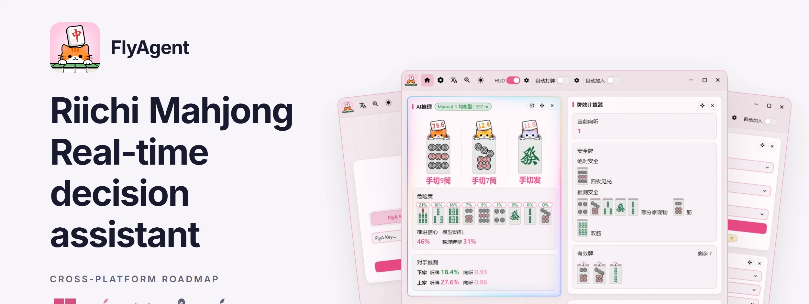
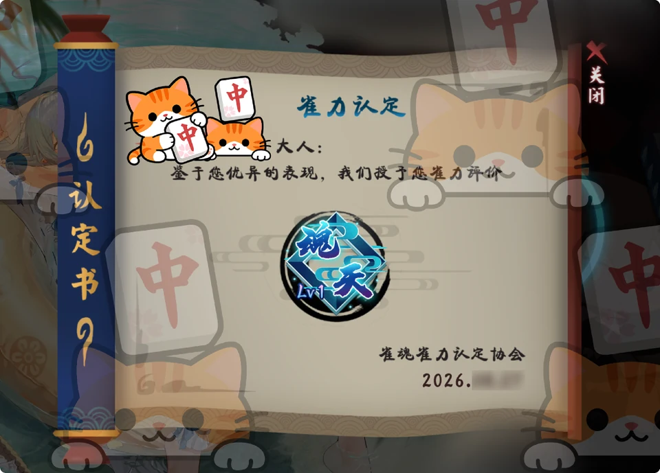
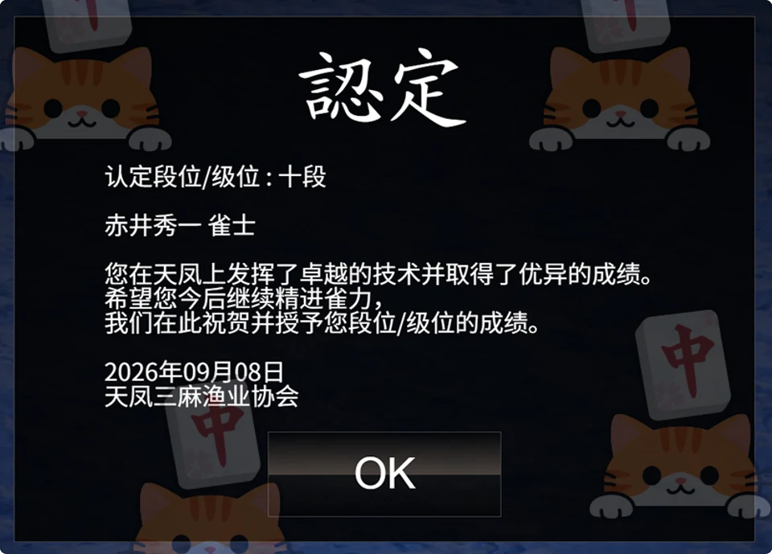
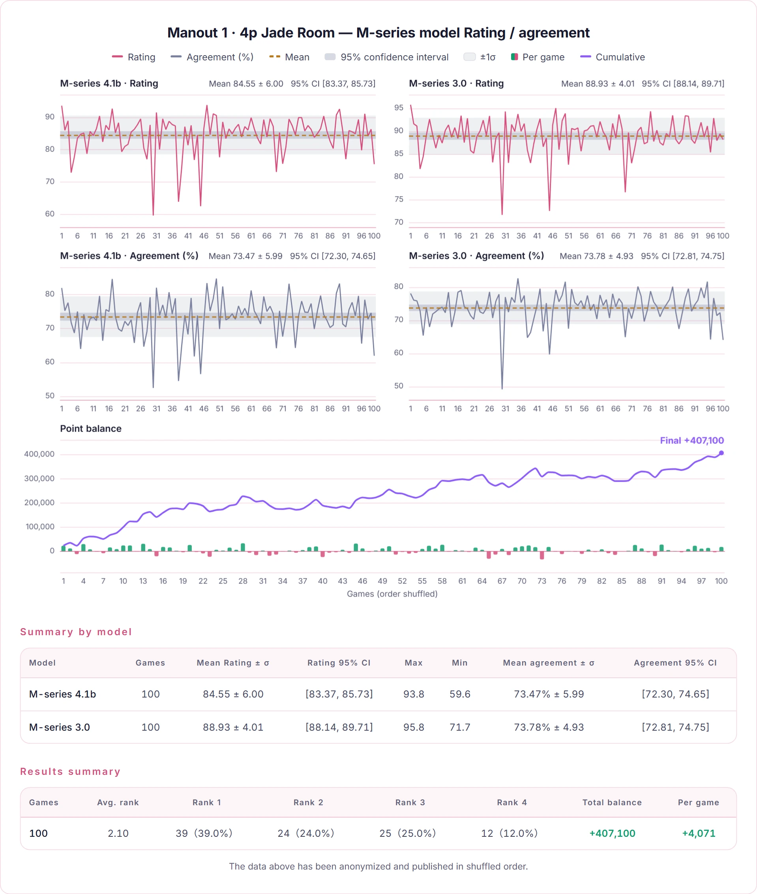

  
  

    <strong>English</strong> | <a href="README_zh-CN.md">简体中文</a> · <a href="README_zh-TW.md">繁體中文</a> · <a href="README_ja.md">日本語</a> ·
    <a href="https://nashout.com">Website</a> ·
    <a href="https://discord.gg/hUwMGczz">Discord</a>
  

---

## Real results · Four-player · Mahjong Soul Celestial · Three-player · Tenhou Judan

<table><tr>
<td align="center" width="50%"> Mahjong Soul · Strength certificate</td>
<td align="center" width="50%"> Tenhou · Rank record</td>
</tr></table>

We're still pushing for higher ranks. As a young model that takes time — new high-rank results will be published once anonymized.

## FlyA Manout · Zero game records — ours alone · trained purely by self-play reinforcement

To surpass humans, you cannot let human intuition steer the training. FlyA Manout never touches a single human game record — it self-plays from absolute zero using CHR (contextual hindsight regret), the algorithm with the strongest Nash-equilibrium convergence guarantees in imperfect-information games. Top-tier strength emerges on its own: no line and no technique was ever taught by a person, each is simply as close to that equilibrium as the model can get. Heyman and Manplus follow a different line: Heyman faithfully imitates human play, while Manplus is distilled from human data and then reinforced through self-play.

| Approach | Where it ends up |
|---|---|
| **CHR — what Manout uses** | guaranteed to converge to a Nash equilibrium, it settles squarely on the mix that is **hardest for opponents to exploit** |
| Policy-gradient methods like PPO | swings to extremes to exploit opponents, gets exploited right back, and circles the optimal mix forever without ever settling |
| Value-function methods like DQN (e.g. the M-series model) | beyond a certain point the policy collapses and degenerates — it retreats into a corner and only knows one play |

**Manout’s zero-style training also brings out techniques only strong human players use — for example:**

- **Bad opening hand? Keep safe tiles early** — It doesn't wait for a riichi to start hunting safe tiles — it reads the deal, sees this hand won't win, and sets a defensive tone from the start
- **Way ahead? Fold it all — even deal in on purpose** — It deliberately gives up the hand to protect its placement. That's score awareness, not tile-power calculation
- **Plenty of counterintuitive anti-efficiency plays** — A tile-efficiency loss, but a higher overall win rate — many of these lines have never been played before

> For the training method and the trade-offs behind it, see [The FlyA design philosophy](https://nashout.com/articles/flya-design-philosophy).

## Genuinely self-developed — no fear of comparison

FlyA models are backed by a firm commitment: no server-side “similarity dodging” and no “dumbing down”, ever. Built on our own algorithms, they cannot “collide” with open-source models.

The data above has been anonymized and published in shuffled order.

## In-game coaching · fast and rich inference output

**Global nodes**: deployed worldwide, with very low inference latency.

- **Candidates** — the model outputs a mixed strategy; the closer the probabilities, the closer the actions are in value
- **Danger** — the deal-in risk of each tile right now
- **Opponent reads** — an estimate of each opponent's current state
- **Model reasoning** — why the model chooses this under its current strategy

> A richer explanation chain is being supervised; the output will grow further.

## HUD overlay · see the reasoning, not the text

- **Clear recommendation icons** — drawn straight onto the tiles, so you never have to compare text
- **Flexible overlay settings** — what it shows, where it sits and how big it is are all yours to set
- **Tsumogiri / tedashi marking** — see at a glance whether each discard was drawn or held

The HUD is **pure visuals plus precomputed coordinates**. It does not hook into any game process — it only draws on top.

## Game stats · look back at every game

Every game you finish is recorded in full, on your own machine.

- **Replay any game** — every discard, and how it differed from the AI's
- **Placement distribution and PT curve** — accumulated from the rank points the platform actually awards
- **Win / deal-in / riichi rates** — a full set of numbers, browsable game by game
- **Export Tenhou logs** — compare them against other models
- **Local only** — never uploaded

## Models and styles · swap the model, swap the play style

Every model has its own character: steady, aggressive, balanced. **The change takes effect on your very next discard.**

- **Several models to choose from** — separate line-ups for 4-player and 3-player, change any time
- **Play styles** — the same model can take on a different character
- **Light on your hardware** — models run in the cloud, so an old laptop keeps up
- **Never idles when the link drops** — a built-in algorithm takes over

## Practice partner · want to train? Play a game against it

Play against the FlyA models in **FlyMahjong**. Following recommendations is one thing; sitting across the table from it is another.

## Support

Mahjong Soul is fully supported; Tenhou and Riichi City currently get in-game coaching only.

| Capability | Mahjong Soul | Tenhou | Riichi City |
|---|:---:|:---:|:---:|
| In-game coaching | ✅ | ✅ | ✅ |
| HUD overlay | ✅ | In progress | In progress |
| Auto play | ✅ | In progress | In progress |
| Auto join | ✅ | In progress | In progress |

Mahjong Soul is supported on the **Chinese, Japanese and English web clients**, and on the Mahjong Soul desktop client.

**Cross-platform plan**: Windows is supported; macOS and Android are in development; Linux and iOS are planned.

## Getting started

Three steps to your first recommendation:

1. **Unzip it** — a portable build: unzip into any folder, no installation and no administrator rights needed. On first launch Windows may show a SmartScreen warning (the archive is not code-signed yet) — choose "Run anyway".
2. **Enter a Key** — no account registration. Paste the Key into the sign-in page and you are done.
3. **Open a table** — open the Mahjong Soul web client from the app and start a game. The recommendation card refreshes with the game on its own. The first time you connect you need to install a certificate; there is a one-click install button in the app.

Full step-by-step guide with screenshots: [FlyAgent user guide](https://nashout.com/articles/user-guide) (Chinese).

> **The installer is not publicly released yet.** For now we send it to you after purchase; a download entry will be added here once it is.

## FAQ

**Will I get banned?**
FlyAgent does not tamper with game data, and it obtains nothing you cannot already see — what it reads is exactly what is on your screen. Please use it within what each platform's rules allow.

**Do I need to register an account?**
No. Buy a Key, paste it into the app, done. No phone number, no email, no account binding.

**Which operating systems are supported?**
Windows is supported today. macOS and Android are in development; Linux and iOS are on the roadmap.

**How many devices can one Key be used on?**
One at a time. Signing in on another device kicks the previous one off, and that device gets an immediate notification so you can confirm it was you.

**Is my game data uploaded?**
Inference runs in the cloud, so the information about the current hand has to reach the server before a recommendation can be computed — that is the precondition for getting advice at all. Game records, however, stay on your own computer and are never uploaded, and the app contains no usage analytics or behavioural tracking of any kind.

**Windows says the app is unsafe after unzipping?**
The archive is not code-signed yet, so Windows shows a SmartScreen warning on first launch — choose "Run anyway". Signing will be added before the official release.

## Safety boundaries

- **Only what is visible** — it works with what is visible at the table anyway: your own hand and melds, the discards, public riichi and dora indicators, your own draws and calls. It **never obtains the wall, opponents' hands, other players' concealed kongs, or any private server-side data**.
- **No cheating capability** — it does not read or modify game memory, inject into game processes, alter game files, or exploit any bug.
- **Records stay local** — game records, certificate and settings all live in the program's own folder; **deleting the folder is the uninstall**.
- **Whether assistive tools are allowed is decided by each platform's rules** — please check and follow them before you use it.

---

  <b>Get a Key</b> (link coming) ·
  <a href="https://nashout.com">Website</a> ·
  <a href="https://nashout.com/articles">Articles</a> ·
  <a href="https://discord.gg/hUwMGczz">Discord</a> ·
  QQ group 1093245435

This software is closed-source commercial software. All rights reserved. See [LICENSE](LICENSE).
