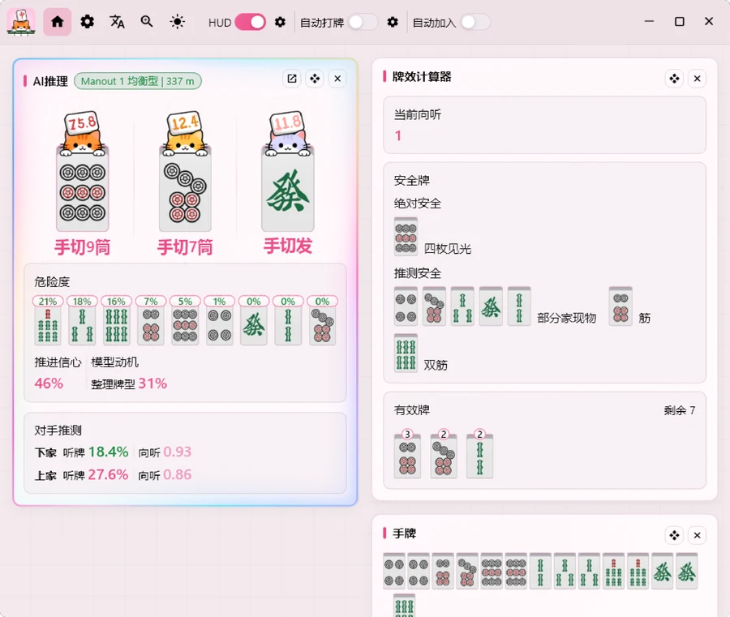
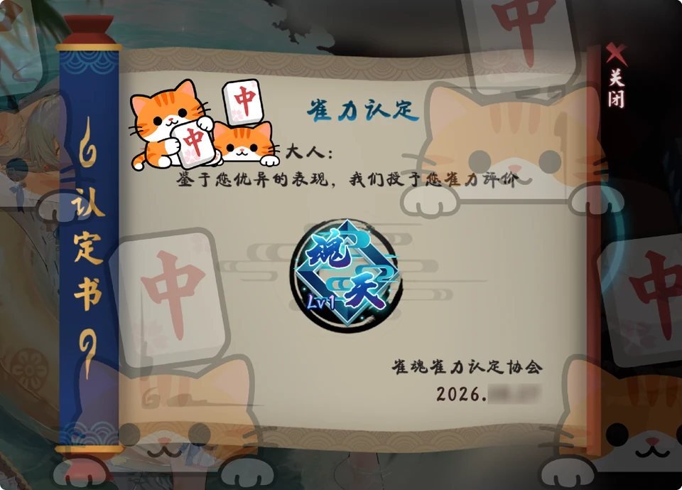
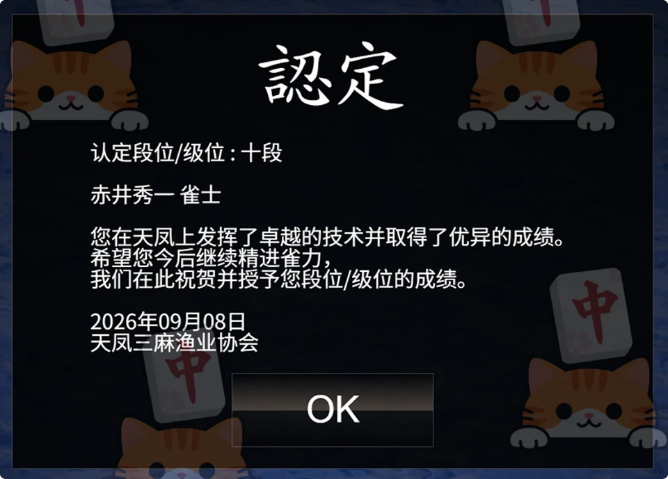
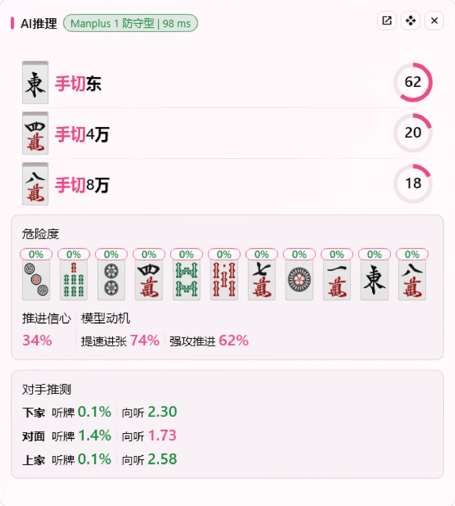
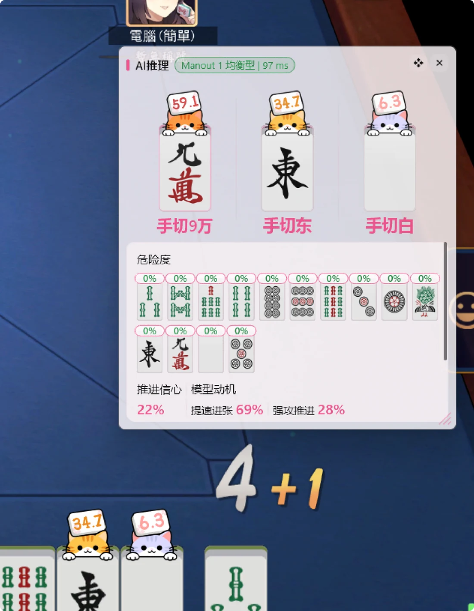
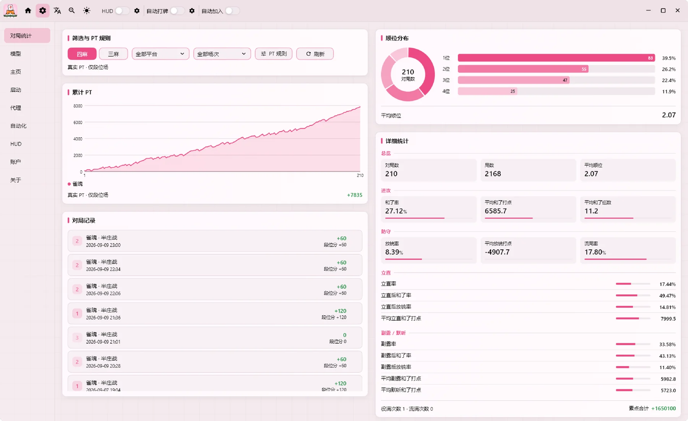
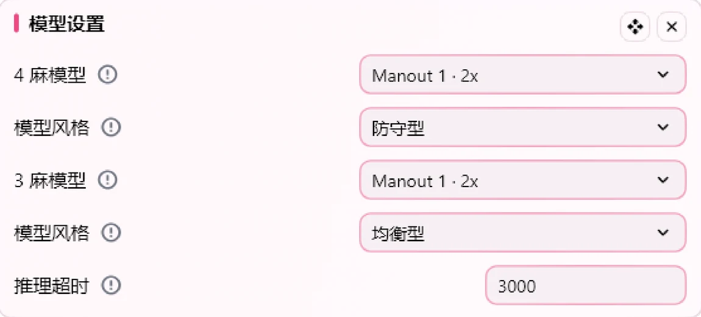

  
  <h1>FlyAgent</h1>
  
<strong>Riichi Mahjong · Real-time coaching agent</strong>

  
<strong>English</strong> · <a href="README_zh-CN.md">简体中文</a> · <a href="README_zh-TW.md">繁體中文</a> · <a href="README_ja.md">日本語</a>

  

    <a href="https://nashout.com/en/download">Download FlyAgent</a> ·
    <a href="https://nashout.com/en">Website</a> ·
    <a href="https://discord.gg/hUwMGczz">Discord</a>
  

## Four-player · Mahjong Soul · Celestial / Three-player · Tenhou · Judan

<table><tr>
<td align="center" width="50%"> Mahjong Soul · Strength certificate</td>
<td align="center" width="50%"> Tenhou · Rank record</td>
</tr></table>

We're still pushing for higher ranks. As a young model that takes time — new high-rank results will be published once anonymized.

## Zero human game records · Trained purely by self-play RL

To surpass humans, you cannot let human intuition steer the training. FlyA Manout uses no human game records: it self-plays from zero with counterfactual regret minimisation — the algorithm with the strongest Nash-equilibrium convergence guarantees in imperfect-information games — and top-tier strength emerges on its own. We also offer the Heyman series, distilled from top human datasets, and Manplus, reinforced on top of Heyman — both easier for newcomers to understand and learn from.

- **Counterfactual regret minimisation — what Manout uses**: guaranteed to converge to a Nash equilibrium, it settles squarely on the mix that is hardest for opponents to exploit.
- **Policy-gradient methods like PPO**: every step counters its own previous step, so it chases its own shadow in circles — always a little off the optimal mix, never converging.

**Manout’s zero-style training also brings out techniques only strong human players use — for example:**

- **Bad opening hand? Keep safe tiles early** — It doesn't wait for a riichi to start hunting safe tiles — it reads the deal, sees this hand won't win, and sets a defensive tone from the start.
- **Way ahead? Fold it all — even deal in on purpose** — It deliberately gives up the hand to protect its placement. That's score awareness, not tile-power calculation.
- **Plenty of counterintuitive anti-efficiency plays** — A tile-efficiency loss, but a higher overall win rate — many of these lines have never been played before.

[The FlyA design philosophy](https://nashout.com/en/articles/flya-design-philosophy)

## Compared with other common models

FlyA models are backed by a firm commitment: no server-side “similarity dodging” and no “dumbing down”, ever. Built on our own algorithms, they cannot “collide” with open-source models.

### Manout 1 · 4p Jade Room — M-series model Rating / agreement

#### Summary by model

| Model | Games | Mean Rating ± σ | Rating 95% CI | Max | Min | Mean agreement ± σ | Agreement 95% CI |
|---|---|---|---|---|---|---|---|
| M-series 4.1b | 100 | 84.55 ± 6.00 | [83.37, 85.73] | 93.8 | 59.6 | 73.47% ± 5.99 | [72.30, 74.65] |
| M-series 3.0 | 100 | 88.93 ± 4.01 | [88.14, 89.71] | 95.8 | 71.7 | 73.78% ± 4.93 | [72.81, 74.75] |

#### Results summary

| Games | Avg. rank | Rank 1 | Rank 2 | Rank 3 | Rank 4 | Total balance | Per game |
|---|---|---|---|---|---|---|---|
| 100 | 2.10 | 39（39.0%） | 24（24.0%） | 25（25.0%） | 12（12.0%） | +407,100 | +4,071 |

The data above has been anonymized and published in shuffled order.

[Website · Rating / Agreement (%) / Point balance](https://nashout.com/en)

## Supported platforms

Mahjong Soul, Tenhou and Riichi City all support in-game coaching and auto-play. Auto-join is supported on Mahjong Soul and Riichi City; Tenhou auto-join is still in progress.

| Capability | Mahjong Soul | Tenhou | Riichi City |
|---|---|---|---|
| In-game coaching | ✅ | ✅ | ✅ |
| HUD overlay | ✅ | ✅ | ✅ |
| Automation | ✅ | ✅ | ✅ |
| Auto-join | ✅ | In progress | ✅ |

Windows is supported today. macOS and Android are in development; Linux and iOS are on the roadmap.

## Fast, richly explained inference

- **Global nodes** — Deployed worldwide, so inference latency stays low
- **Candidates** — A mixed-strategy output — the closer two candidates are, the closer their impact on the game
- **Danger** — The immediate deal-in risk of every tile
- **Opponent reads** — An estimate of each opponent’s current state
- **Model reasoning** — Why the current strategy chose what it chose

> A richer explanation pipeline is in training — the output will keep getting more detailed.

## Reasoning results, shown intuitively

- **Beautiful recommendation icons** — Drawn right on the tiles — no text to match up
- **Flexible overlay settings** — What to show, where to put it, how big — all up to you
- **Tedashi / tsumogiri indicator** — See at a glance whether each discard was tedashi or tsumogiri

The HUD overlay is **pure visuals + precomputed coordinates** — it doesn't hook into any game process, it's a purely external display.

## History & review

- **Replay any game, anytime** — Review every move against what the AI would have done
- **Placement distribution & PT curve** — Accumulated from the rank points each platform actually awards
- **Win rate / deal-in rate / riichi rate** — A full set of numbers, browsable game by game
- **Export Tenhou logs** — Compare them against other models
- **Stored locally only** — Nothing is uploaded

## Models & styles

- **Several models** — Separate lineups for 4-player and 3-player — switch whenever you like
- **Playstyle** — Even the same model can change its temper
- **No hardware needed** — Models run in the cloud, so an old laptop is fine
- **Never stalls** — The built-in algorithm takes over

## Getting started

Three steps to your first recommendation

1. **Download and extract** — Portable build: extract it to any folder and run — no installation, no admin rights. On first launch Windows may show a SmartScreen prompt; choose "Run anyway".
2. **Enter a Key** — No account needed. Just paste your Key into the login page — one Key works on only one device at a time.
3. **Open a table** — Open Mahjong Soul web from FlyAgent and join a game. The recommendation card refreshes automatically with the match — no manual action.

[FlyAgent user guide](https://nashout.com/en/articles/user-guide) · [Download from GitHub](https://github.com/FlyA-official/FlyAgent/releases) · [Buy a Key](https://nashout.com/en/pricing)

## FAQ

**Will I get banned?**

FlyAgent doesn't tamper with game data, and it doesn't obtain anything you couldn't already see — what it reads is exactly what's on your screen.

Please use it within the bounds each platform's rules allow.

**Do I need to create an account?**

No. Buy a Key, paste it into the app, and you're done — no phone number, no email, nothing bound to any account.

**Which operating systems are supported?**

Windows is supported today. macOS and Android are in development; Linux and iOS are on the roadmap.

**How many devices can one Key be used on?**

One device at a time. Logging in on another device kicks the previous one off, and it's notified immediately. If it wasn't you, you can log back in from that device to take the Key back, or freeze the Key: every device is signed out at once and the Key becomes permanently unusable and cannot be restored — contact support to get a replacement.

**Will my game data be uploaded?**

Inference runs in the cloud, so the current hand's information has to be sent to the server to compute a recommendation — that's the very premise of giving advice.

But your match records live only on your own computer and are never uploaded — and the app contains no usage statistics or behavior tracking whatsoever.

**Windows warns it is unsafe after extracting?**

The archive is not digitally signed yet. On first launch Windows shows a SmartScreen prompt — choose "Run anyway". Signing will be added before the official release.

**How do updates work?**

The app checks for new versions in the background — if it finds one, it just lights up an update button. Whether to update is your call. Every download is verified end-to-end; if verification fails, it never runs.

**How do I remove it?**

Just delete the extracted folder — no uninstaller, no leftovers. The certificate can be removed in one click from inside the app.

---

[Download FlyAgent](https://nashout.com/en/download) · [Buy a Key](https://nashout.com/en/pricing) · [Guides and release notes](https://nashout.com/en/articles) · [FlyMahjong](https://flymahjong.nashout.com/) · [Discord](https://discord.gg/hUwMGczz)

This software is closed-source commercial software. All rights reserved. See [LICENSE](LICENSE).
