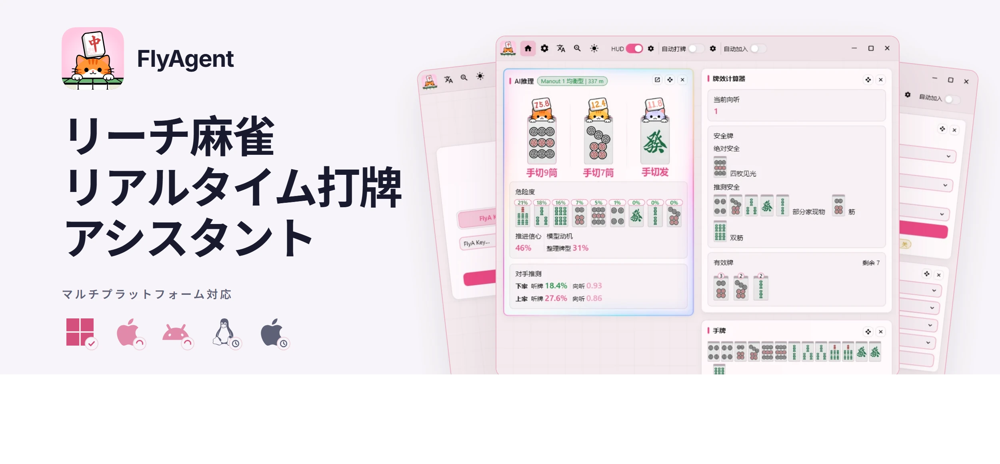
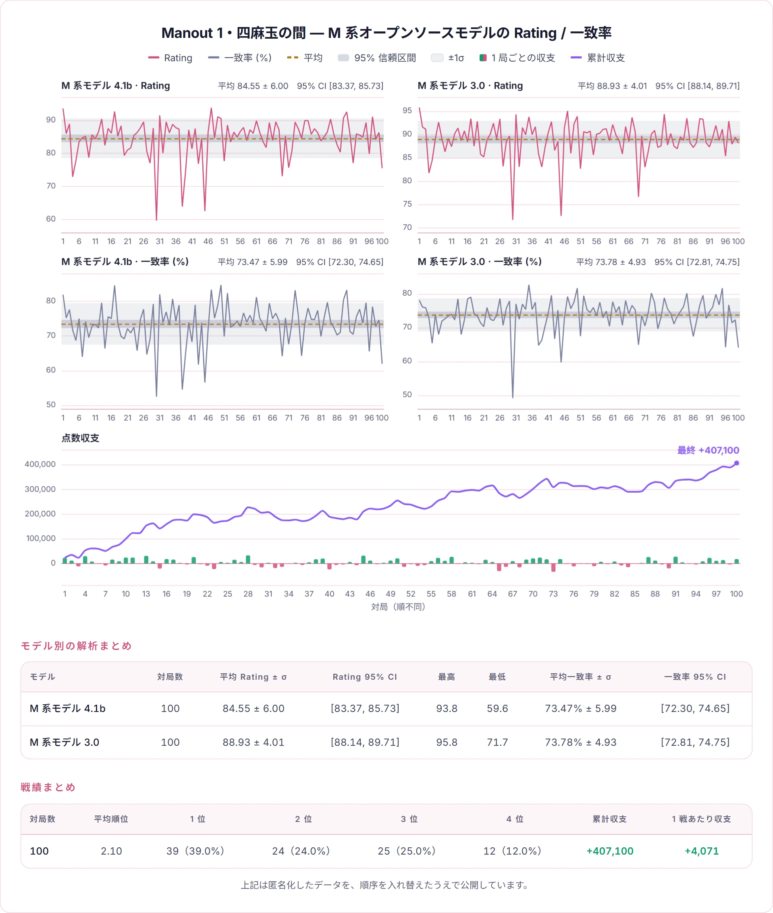

  
  

    <a href="README_zh-CN.md">简体中文</a> · <a href="README_zh-TW.md">繁體中文</a> · <a href="README.md">English</a> | <strong>日本語</strong> ·
    <a href="https://nashout.com">公式サイト</a> ·
    <a href="https://discord.gg/hUwMGczz">Discord</a>
  

---

## 実際の実績 · 四麻 雀魂魂天 · 三麻 天鳳十段

<table><tr>
<td align="center" width="50%"> 雀魂 · 雀力認定書</td>
<td align="center" width="50%"> 天鳳 · 段位記録</td>
</tr></table>

私たちはさらに上の段位を目指して挑戦を続けています。新しいモデルとして時間はかかりますが、新たな高段位の実績は匿名化のうえ公開します。

## FlyA Manout · 独自のゼロ牌譜 · 自己対戦による強化学習

人間を超えるには、人間の発想で学習を誘導してはいけません。FlyA Manout は人間の牌譜を一切使わず、不完全情報ゲームの分野で最も強力なナッシュ均衡への収束保証を持つCHR（後知事実の後悔）アルゴリズムで、0 から自己対戦を重ねます。トップクラスの牌力は自発的に創発したもので、その「打ち方」「技術」はどれも人が教えたものではなく、その均衡に可能なかぎり近づいた結果です。Heyman と Manplus は別の系統です。Heyman は人間の打ち方を忠実に模倣し、Manplus は人間のデータから蒸留したうえで自己対戦で強化しています。

| 手法 | 行き着く先 |
|---|---|
| **CHR · Manout が採用** | ナッシュ均衡への収束が保証されており、**相手に最も狙われにくい**配分に確実に収まります |
| PPO などの方策勾配法 | 極端に振り切って相手を狙い、今度は相手に狙い返され、最適な配分の周りをぐるぐる回り続けて止まれません |
| DQN などの価値関数法（M 系オープンソースモデルなど） | ある時点まで進むと方策が崩壊・退化し、隅に閉じこもってひとつの打ち方しかできなくなります |

**Manout の Zero 式の学習でも、人間の上級者しか使いこなせない技術が創発します。たとえば：**

- **配牌が悪いと、早めに安牌を残す** — 誰かがリーチしてから安全牌を探し始めるのではなく、配牌の時点でこの局は攻められないと見切り、守りの構えを決めます
- **大きくリードしたら全降り、時には差し込み** — 順位を守るために、その局を自ら捨てる。これは点数の感覚であって、牌力の計算ではありません
- **直感に反する逆牌効率を次々と打つ** — 牌効率だけ見れば損ですが、総合的な勝率は高い——これまで誰も打たなかった手が少なくありません

> 学習手法とその裏にあるトレードオフについては、[FlyA の設計思想](https://nashout.com/articles/flya-design-philosophy) をご覧ください。

## 本物の独自開発、比較は歓迎

FlyA シリーズのモデルは、サーバー側での「類似度下げ」や「性能の意図的な低下」を一切行わないことをお約束します。独自アルゴリズムのため、オープンソースモデルと「かぶる」ことはありません。

上記は匿名化したデータを、順序を入れ替えたうえで公開しています。

## 対局中のコーチング · 高速かつ豊富な推論出力

**グローバルノード**：世界各地に配備されており、推論レイテンシは極めて低いです。

- **候補** — 混合戦略を出力。候補の確率が近いほど、その行動の価値が近いことを意味します
- **危険度** — いま切った場合の各牌の放銃リスク
- **相手の読み** — 各相手の現在の状態の推測
- **モデルの意図** — 現在の戦略のもとで、なぜその打牌を選ぶのか

> より豊富な説明チェーンは現在監修中で、今後さらに出力が充実していきます。

## HUD オーバーレイ · 文字ではなく推論を見る

- **見やすい推奨アイコン** — 牌の上に直接描画されるため、文字を見比べる必要がありません
- **柔軟なオーバーレイ設定** — 何を表示するか、どこに置くか、どのくらいの大きさか、すべて自分で設定できます
- **ツモ切り／手出しの表示** — その捨て牌がツモ切りだったのか手出しだったのか、一目で分かります

HUD は**純粋な描画と座標の事前計算**のみで実装されています。ゲームのプロセスには一切フックせず、上から描画するだけです。

## 対局統計 · 打ち終えた後に振り返る

自分が打ち終えた一局一局が、すべて手元のマシンに完全な形で記録されます。

- **いつでも一局を再生** — 打牌ごとに、AI との違いまで振り返れます
- **順位分布と PT 曲線** — プラットフォームが実際に付与した段位ポイントで積み上げ
- **和了率 / 放銃率 / リーチ率** — 数値一式を、一局ずつ見返せます
- **天鳳牌譜のエクスポート** — 他のモデルと比較できます
- **端末内のみ** — アップロードはしません

## モデルとスタイル · モデルを替えれば、打ち方も変わる

モデルごとに個性があります：堅実なもの、攻め的なもの、バランス型。**選んだ瞬間、次の打牌から反映されます。**

- **複数のモデルから選択可能** — 四人打ちと三人打ちでそれぞれラインナップがあり、いつでも変更できます
- **打ち方のスタイル** — 同じモデルでも、別の性格に切り替えられます
- **マシンへの負担が軽い** — モデルはクラウド上で動作するため、古いノート PC でも快適に使えます
- **接続が切れても空回りしない** — 内蔵アルゴリズムが引き継ぎます

## 練習相手 · 腕を磨きたいなら、そのまま一局打ってみる

**FlyMahjong** では FlyA 系モデルと対局できます。推奨に従って打つのと、実際に対面に座って打たれるのとでは、まったく別の経験です。

## 対応状況

雀魂は完全対応；天鳳 と 一番街 は現在、対局中のコーチングのみに対応しています。

| 機能 | 雀魂 | 天鳳 | 一番街 |
|---|:---:|:---:|:---:|
| 対局中のコーチング | ✅ | ✅ | ✅ |
| HUD オーバーレイ | ✅ | 準備中 | 準備中 |
| 自動操作 | ✅ | 準備中 | 準備中 |
| 自動参加 | ✅ | 準備中 | 準備中 |

雀魂は Web 版の**中国語版・日本語版・英語版**に対応しており、雀魂のデスクトップクライアントにも接続できます。

**クロスプラットフォーム計画**：Windows は対応済み；macOS と Android は開発中；Linux と iOS は計画中です。

## はじめかた

最初の推奨を受け取るまで、3 ステップです：

1. **解凍する** — ポータブル版なので、任意のフォルダに解凍するだけで、インストールも管理者権限も不要です。初回起動時に Windows が SmartScreen の警告を表示することがあります（アーカイブはまだコード署名されていません）——その場合は「実行」を選択してください。
2. **Key を入力する** — アカウント登録は不要です。Key をログイン画面に貼り付ければ完了です。
3. **牌卓を開く** — アプリから雀魂の Web クライアントを開き、対局を始めてください。推奨カードは対局に合わせて自動で更新されます。初回接続時には証明書のインストールが必要で、アプリにワンクリックのインストールボタンがあります。

スクリーンショット付きの詳しい手順は、公式サイトの [FlyAgent 使用ガイド](https://nashout.com/articles/user-guide)（中国語）をご覧ください。

> **インストーラーはまだ一般公開されていません。** 現時点ではご購入後に直接お送りしています。正式リリース後、ここにダウンロード入口を追加します。

## よくあるご質問

**BAN されませんか？**
FlyAgent は対局データを改ざんしませんし、あなたが本来見られない情報を取得することもありません——読み取る内容は、あなたの画面に表示されているものとまったく同じです。各プラットフォームの規則の範囲内でご使用ください。

**アカウント登録は必要ですか？**
いいえ。Key を購入してアプリに貼り付けるだけです。電話番号もメールアドレスも不要で、アカウントの紐付けもありません。

**対応 OS は？**
Windows は対応済みです。macOS と Android は開発中、Linux と iOS は計画中です。

**1 つの Key は何台の端末で使えますか？**
同時に 1 台までです。別の端末でサインインすると前の端末は弾かれ、その端末にはすぐに通知が届くので、ご本人の操作かどうかを確認できます。

**対局データはアップロードされますか？**
推論はクラウドで実行されるため、現在の手牌の情報をサーバーに送信しなければ推奨を計算できません——これが助言を得るための前提条件です。ただし対局記録はご自身の PC 内に留まり、アップロードされることはありません。アプリには利用統計や行動トラッキングといった類のものも一切含まれていません。

**解凍後に Windows が「安全ではない」と警告してきますか？**
アーカイブはまだコード署名されていないため、初回起動時に Windows が SmartScreen の警告を表示します——「実行」を選択してください。署名は正式リリース前に追加されます。

## 安全性の境界

- **見える情報だけを使う** — そもそも牌卓で見えている情報だけを扱います：自分の手牌と副露、牌河、公開されているリーチとドラ表示牌、自分のツモと鳴き。**牌山、相手の手牌、他家の暗槓、サーバー側の非公開データは一切取得しません**。
- **チート能力はありません** — ゲームのメモリを読み書きせず、ゲームプロセスに注入せず、ゲームファイルを改変せず、いかなる脆弱性も悪用しません。
- **記録は端末内のみ** — 対局記録・証明書・設定はすべてプログラム自身のフォルダ内にあります。**フォルダを削除することが、そのままアンインストールになります**。
- **補助ツールが許可されるかどうかは各プラットフォームの規則が決めます** — 使用前に必ず確認し、それに従ってください。

---

  <b>Key を購入</b>（リンク準備中） ·
  <a href="https://nashout.com">公式サイト</a> ·
  <a href="https://nashout.com/articles">記事</a> ·
  <a href="https://discord.gg/hUwMGczz">Discord</a> ·
  QQ グループ 1093245435

本ソフトウェアはクローズドソースの商用ソフトウェアです。All rights reserved. 詳細は [LICENSE](LICENSE) をご覧ください。
