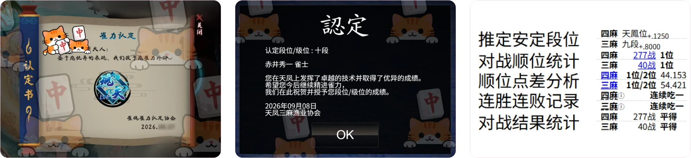
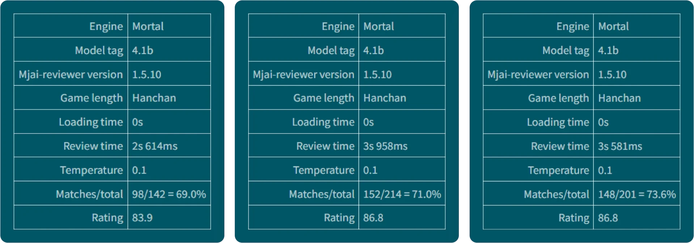
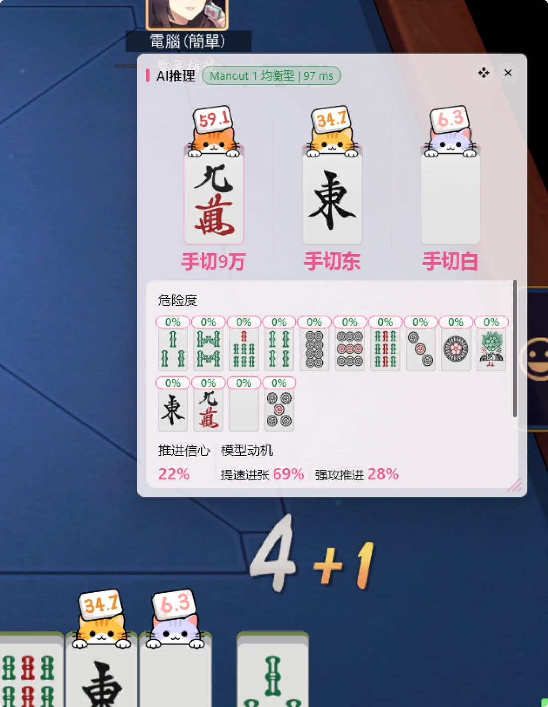
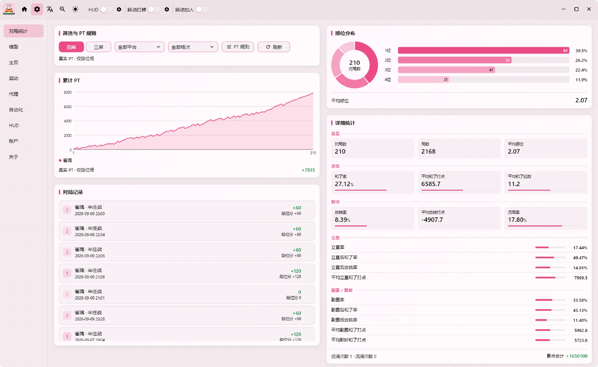
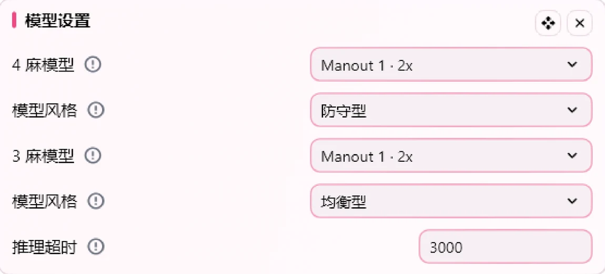

  
  

    <a href="README.md">English</a> · <a href="README_zh-TW.md">繁體中文</a> · <a href="README_ja.md">日本語</a> | <strong>简体中文</strong> ·
    <a href="https://nashout.com">官网</a> ·
    <a href="https://discord.gg/hUwMGczz">Discord</a>
  

---

## 雀魂 魂天 · 天凤 十段 · 天凤 安定段位 天鳳位

我们正在持续尝试冲击天凤位。作为新兴模型，这需要一定时间。

## 独家零牌谱 · 自对弈强化训练方法

FlyA 模型做到了**不使用任何人类牌谱**，使用非完美信息博弈领域最有纳什均衡收敛保障的「反事实遗憾最小化」算法，从 0 开始自对弈，自发地涌现出顶级牌力。

我们走过三条路，也看清了它们的区别：

| 方法 | 结果 |
|---|---|
| **反事实遗憾最小化（CFR）** · FlyA 用的 | 有纳什均衡收敛保障，稳稳落在**最不容易被对手针对**的那个配比上 |
| PPO 等策略梯度 | 冲向极端去针对对手，又被对手针对回来，绕着最优配比一圈圈打转，始终停不下来 |
| DQN 等值函数方法（如 Mortal） | 练到某个点之后策略崩溃、退化，缩进角落里只会一种打法 |

**Zero 式训练同样能涌现出人类高手才会熟练使用的技巧：**

- **配牌不好，早早留安** — 不是等到有人立直才开始找安全牌，是开局就认清这把打不了，先定下防守基调
- **大幅领先时全弃电报** — 为了守住顺位主动放弃这一局。这是分数意识，不是牌力计算
- **大量反直觉的逆牌效** — 牌效上算亏，但综合胜率更高——很多是以前没人这么打过的

> 训练方法与取舍，见官网文章《[FlyA 设计哲学](https://nashout.com/articles/flya-design-philosophy)》。

## 真自研，不怕对比

以下为开源模型 Mortal 的跑谱结果。**极低的决策重合率**，更加证明 FlyA 系模型的独特打法。无惧「跑谱」，无需「降重」。

## 局内教学 · 极速且丰富的推理输出

**全球节点**：全球部署，极低的推理延迟。

- **候选** — 混合策略输出，候选概率越接近，说明动作影响越接近
- **危险度** — 每张牌当下的放铳风险
- **对手推测** — 推测每个对手的当前状态
- **模型动机** — 展示当前策略下的模型动机

> 更丰富的解释链路正在监督中，未来会进一步丰富输出内容。

## HUD 叠加层 · 直观的推理结果展示

- **精美的推荐图标** — 直接画在牌面上，不用比对文字
- **灵活的叠加层设置** — 显示什么、放在哪、多大，都能自己调
- **手摸切显示** — 每一张出牌是手切还是摸切，一眼分得清

HUD 叠加层的实现是**纯视觉 + 坐标预计算**，不 hook 任何游戏进程，纯外部显示。

## 对局统计 · 打完还能回头看

你自己打完的每一局都完整记在本机。

- **随时回放每一局** — 每一手与 AI 的差异都能被复盘
- **顺位分布与 PT 曲线** — 按平台实际给的段位分累计
- **和了率 / 放铳率 / 立直率** — 一整套数字，逐局可翻
- **导出天凤牌谱** — 拿去 Mortal 官网跑检讨
- **只存本机** — 不上传

## 模型与风格 · 换个模型，换种打法

每个模型有自己的性格：稳的、凶的、均衡的。**选完下一手就生效**。

- **多个模型可选** — 四麻三麻各有阵容，想换随时换
- **打法风格** — 同一个模型，也能换个性格
- **不吃你的配置** — 模型跑在云端，老笔记本也带得动
- **断了不空转** — 内置算法兜底

## 陪练 · 想练手，直接和它下一局

可在 **FlyMahjong** 中与 FlyA 系列模型对弈，提升你的牌力。跟着推荐打是一回事，坐在它对面挨打是另一回事。

## 支持范围

雀魂完整支持；天凤与一番街目前只做局内教学。

| 能力 | 雀魂 | 天凤 | 一番街 |
|---|:---:|:---:|:---:|
| 局内教学 | ✅ | ✅ | ✅ |
| HUD 叠加层 | ✅ | 跟进中 | 跟进中 |
| 自动操作 | ✅ | 跟进中 | 跟进中 |
| 自动加入 | ✅ | 跟进中 | 跟进中 |

雀魂支持网页端**中文服 / 日服 / 英文服**，也可以接雀魂客户端。

**跨平台计划**：Windows 已支持；macOS、Android 开发中；Linux、iOS 计划中。

## 开始使用

三步就能收到第一条推荐：

1. **下载并解压** — 绿色便携版，解压到任意文件夹即可，不需要安装，也不需要管理员权限。首次运行 Windows 可能弹 SmartScreen 提示（压缩包还没有做数字签名），选择「仍要运行」。
2. **填一枚 Key** — 不用注册账号。把 Key 粘进登录页就行。
3. **打开牌桌** — 从软件里打开雀魂网页端，进入对局。推荐卡会随牌局自动刷新，不需要手动操作。第一次接入需要装一张证书，应用里有一键安装按钮。

完整的图文步骤见官网《[FlyAgent 使用说明](https://nashout.com/articles/user-guide)》。

> **安装包尚未公开发布**，当前购买后我们会直接发给你；正式发布后这里会补上下载入口。

## 常见问题

**会不会被封号？**
FlyAgent 不篡改对局数据，也不获取任何你本来看不到的信息——它读到的和你屏幕上看到的完全一致。请在各平台规则允许的范围内合规使用。

**需要注册账号吗？**
不需要。买一枚 Key 填进软件就能用，不要手机号，不要邮箱，不绑定任何账号。

**一枚 Key 能在几台设备上用？**
同时只能一台。换设备登录会把上一台顶下来，上一台会立刻收到通知，可以确认是不是本人操作。

**我的牌局数据会被上传吗？**
推理在云端完成，所以当前这一手的牌局信息需要发到服务器才能算出推荐——这是它能给出建议的前提。但对局记录只保存在你自己电脑上，不会上传；软件里也没有任何使用统计或行为埋点。

**解压后 Windows 提示不安全？**
压缩包还没有做数字签名，首次运行 Windows 会弹 SmartScreen 提示，选择「仍要运行」即可。签名会在正式发布前补上。

## 安全边界

- **只用看得见的信息** — 它处理的是牌桌上本该看得见的东西：自己的手牌与副露、牌河、公开的立直与宝牌、自己的摸牌鸣牌。**不获取牌山、对手手牌、他人暗杠或任何服务端私有数据**。
- **无作弊能力** — 不读取或修改游戏内存、不注入游戏进程、不篡改游戏文件、不利用任何漏洞。
- **记录只在本机** — 对局记录、证书、配置全在程序自己的目录里，**删掉文件夹就等于卸载**。
- **是否允许辅助工具由各平台规则决定** — 请在使用前自行了解并遵守对应平台的规则。

---

  <b>购买 Key</b>（链接待配置） ·
  <a href="https://nashout.com">官网</a> ·
  <a href="https://nashout.com/articles">文章</a> ·
  <a href="https://discord.gg/hUwMGczz">Discord</a> ·
  QQ 群 1093245435

本软件为闭源商业软件，保留所有权利。详见 [LICENSE](LICENSE)。
